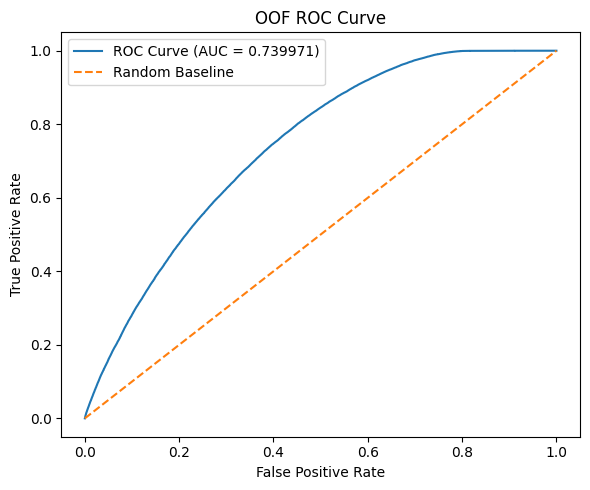
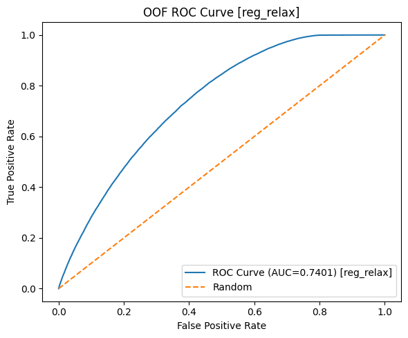
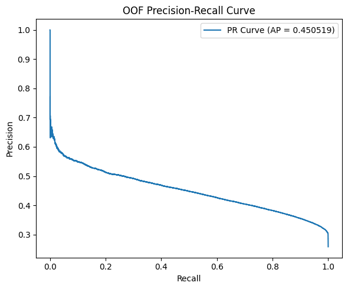
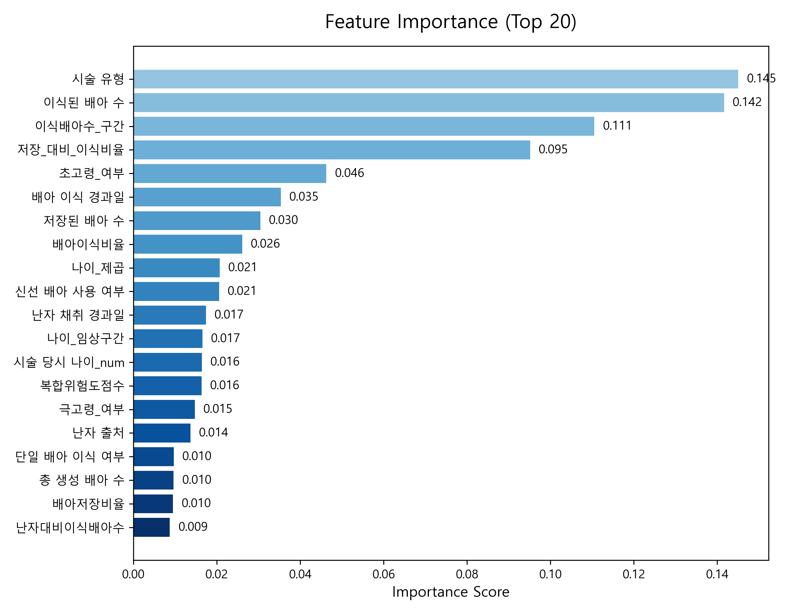

<div align="center">
 
# 🧬 난임 치료를 위한 AI 모델
## 임신 성공 예측 — Machine Learning 기반
 
<br>
 
[](https://python.org)
[](https://xgboost.readthedocs.io)
[](https://catboost.ai)
[](https://lightgbm.readthedocs.io)
 
<br>
 
### 🏆 리더보드 점수
 
# `ROC-AUC : 0.74218`
 
<br>
 
</div>
 
---
 
## 📌 프로젝트 개요
 
> 난임 환자 데이터를 기반으로 **임신 성공 여부를 예측하는 AI 모델**을 개발하는 프로젝트입니다.
 
난임은 전 세계적으로 증가하는 중요한 의료 문제로,  
많은 환자들이 치료 과정에서 **신체적·정신적 부담과 높은 비용**을 경험합니다.
 
**최소한의 시술로 임신 성공 가능성을 높이는 것**은 매우 중요한 의료 목표이며,  
본 프로젝트는 AI 기반 예측 모델을 통해 **데이터 기반 의사결정 지원**에 기여하고자 합니다.
 
<br>
 
| 🎯 과제 | 🏥 도메인 | ✅ 검증 방법 | 📏 평가 지표 |
|:---:|:---:|:---:|:---:|
| 임신 성공 여부 예측 | 난임 시술 (보조생식술) | Stratified K-Fold (5-Fold) | ROC-AUC |
 
<br>
 
---
 
## 🏅 성능 요약
 
<div align="center">
 
| 모델 | XGB 버전 | OOF ROC-AUC | 리더보드 |
|:---:|:---:|:---:|:---:|
| XGBoost v2 reg_relax — Day2 단일 기준 | xgb v2 | 0.74011 | — |
| XGBoost Optuna v1 — 단일 최고 | xgb optuna | 0.74016 | — |
| Probability Weighted Ensemble — OOF 최고 | xgb optuna | 0.740482 | — |
| 🥇 **Rank Ensemble — 최종 제출 모델** | xgb v2 | 0.740448 | **0.74218** |
| ⭐ **Rank Ensemble — 최신 재실험 최고** | xgb optuna | **0.740487** | — |
 
</div>
 
<br>
 
> 💡 **최종 제출 모델 기준**  
> OOF ROC-AUC: **0.740448**  
> Public LB: **0.74218**  
> → OOF 대비 **+0.00173 상승**, 과적합 없이 안정적으로 일반화됨을 확인
 
> 💡 **최신 내부 검증 최고 모델 기준**  
> Probability Weighted Baseline: **0.740444**  
> Rank Weighted Ensemble: **0.740487**  
> → Baseline 대비 **+0.000043**
 
<br>
 
---
 
## 🏗️ 모델 구조
 
```text
┌────────────────────────────────────────────────────────────┐
│                        기본 모델 층                         │
├────────────────────────────────────────────────────────────┤
│  🔵 XGBoost v2 (reg_relax)   : 0.74011                    │
│  🔵 XGBoost Optuna v1        : 0.74016                    │
│  🟠 CatBoost v2              : 0.74005                    │
│  🟢 LightGBM v1              : 0.73987                    │
└────────────────────────────────────────────────────────────┘
                           │
                           ▼
┌────────────────────────────────────────────────────────────┐
│                     Ensemble 실험 층                        │
├────────────────────────────────────────────────────────────┤
│  v1  XGB v2 + CAT                      → 0.740381         │
│  v2  3모델 Probability Ensemble        → 0.740444         │
│  v2* 3모델 Probability Ensemble        → 0.740482         │
│      (XGB Optuna 반영)                                     │
│  v3  Stacking (LogisticRegression)     → 0.740128 ❌       │
│  v4  Rank Ensemble (XGB v2)            → 0.740448         │
│      └─ Public LB                      → 0.74218 ✅        │
│  v4* Rank Ensemble (XGB Optuna)        → 0.740487 ⭐       │
└────────────────────────────────────────────────────────────┘
```
 
> `*` 표시는 동일한 Ensemble 구조를 XGBoost Optuna 버전으로 재실행한 결과를 의미한다.
 
<br>
 
### 모델 선정 이유
 
| 모델 | 선정 이유 | 비고 |
|:---:|---|---|
| 🔵 **XGBoost** | 표 형식 의료 데이터에서 강한 기본 성능 | reg_relax, Optuna 모두 실험 |
| 🟠 **CatBoost** | 범주형 처리 강점 + Ensemble Diversity 기여 최대 | 가중치가 꾸준히 높게 나옴 |
| 🟢 **LightGBM** | Leaf-wise Split으로 다른 예측 패턴 제공 | 빠른 학습 속도 |
| 📊 **Rank Ensemble** | Probability Calibration 차이를 줄여 안정적 결합 | 최신 내부 검증 최고 성능 |
 
<br>
 
---
 
## 🔎 검증 전략
 
```
전체 학습 데이터 (N개 샘플)
          │
          ▼
  Stratified K-Fold (5-Fold)
  → Class Imbalance 대응
  → Fold 간 클래스 비율 유지
          │
    ┌─────┼─────┬─────┬─────┐
    ▼     ▼     ▼     ▼     ▼
  Fold1 Fold2 Fold3 Fold4 Fold5
    └─────┴─────┴─────┴─────┘
                  │
                  ▼
      OOF Prediction (전체 데이터 커버)
                  │
                  ▼
        OOF ROC-AUC 계산
      + Ensemble Meta Feature 재활용
```
 
| 항목 | 내용 |
|------|------|
| ✅ 선택 이유 | Class Imbalance 대응, Fold 간 클래스 비율 유지 |
| 📈 장점 | 안정적 검증 + OOF로 Ensemble / Stacking 재활용 가능 |
 
<br>
 
---
 
## ⚙️ Feature Engineering
 
> 🏥 난임 치료 도메인 지식을 기반으로 **30개 이상의 파생 변수** 생성
 
<br>
 
### 🧪 A. 배아 처리 단계별 전환율
*난자 → 배아 → 이식으로 이어지는 보조생식술 과정의 단계별 전환율*
 
| Feature | 계산식 | 의미 |
|---------|------|------|
| 배아생성효율 | 생성 배아 / 수집 난자 | 실험실 수정 품질 |
| ICSI수정효율 | 배아 생성 / 미세주입 난자 | ICSI 성공률 |
| 배아이식비율 | 이식 배아 / 총 생성 배아 | 이식 활용도 |
| 배아저장비율 | 저장 배아 / 총 생성 배아 | 잉여 배아 지표 |
| 난자활용률 | 미세주입 난자 / 수집 난자 | 전체 난자 활용도 |
 
<br>
 
### 📋 B. 과거 시술 이력
*과거 시술 이력 기반 성공 확률 반영*
 
| Feature | 계산식 | 의미 |
|---------|------|------|
| 전체임신률 | 총 임신 / 총 시술 | 전체 누적 성공률 |
| IVF임신률 | IVF 임신 / IVF 시술 | IVF 특이적 성공률 |
| DI임신률 | DI 임신 / DI 시술 | DI 특이적 성공률 |
| 임신유지율 | 총 출산 / 총 임신 | 임신 → 출산 유지율 |
| 클리닉집중도 | 클리닉 내 시술 / 총 시술 | 치료 연속성 지표 |
 
<br>
 
### ⚠️ C. 반복 실패 패턴
*임상적으로 독립적인 불량 예후 인자*
 
| Feature | 기준 | 임상적 의미 |
|---------|:----:|------------|
| 총실패횟수 | 시술 - 임신 | 전체 누적 실패 |
| IVF실패횟수 | IVF 시술 - IVF 임신 | IVF 특이적 실패 |
| 반복IVF실패 여부 | **≥ 3회** (Binary) | ⚠️ RIF 진단 기준 |
 
> 🔴 **RIF (Recurrent Implantation Failure)**: IVF 실패 3회 이상은 임상 가이드라인상 독립적 불량 예후 인자로 분류
 
<br>
 
### 👩‍⚕️ D. 나이 기반 위험도
*난임 치료에서 가장 중요한 단일 변수*
 
| Feature | 기준 | 임상적 의미 |
|---------|:----:|:------------:|
| 나이 | 연속형 | 기본 나이 정보 |
| 나이² | — | 비선형 나이 효과 포착 |
| 고령 여부 | **≥ 35세** | 고령 임신 기준선 |
| 초고령 여부 | **≥ 40세** | 성공률 급락 구간 |
| 극고령 여부 | **≥ 42세** | 건강보험 급여 상한 근방 |
 
<br>
 
### 🔗 E. Interaction Feature
*단순 Feature보다 복합적인 환자 상태 반영*
 
| Feature | 조합 | 포착하는 효과 |
|---------|------|--------------|
| 나이 × 시술횟수 | 고령 + 반복 시술 | 예후 악화 복합 지표 |
| 나이 × IVF실패 | 고령 + 반복 실패 | 가장 불량한 예후 집단 |
| 나이 × IVF임신률 | 고령 + 성공 경험 | 상대적 양호 집단 식별 |
| 초고령 × 반복실패 | Binary 교차 | RIF + 고령 복합 위험 |
 
<br>
 
### 📊 Feature Engineering 요약
 
| Feature 그룹 | 변수 수 | 핵심 기여 |
|:---:|:---:|---|
| 🧪 배아 처리 효율 | 7개 | 실험실 품질 정보 |
| 📋 과거 시술 이력 | 8개 | 과거 성공 이력 |
| ⚠️ 반복 실패 패턴 | 3개 | 반복 실패 위험 |
| 👩‍⚕️ 나이 위험도 | 5개 | 나이 임계점 효과 |
| 🔗 Interaction | 4개 | 복합 위험 포착 |
| **합계** | **30개 이상** | |
 
<br>
 
---
 
## 📅 실험 기록
 
---
 
### 🗓️ Day 1 — XGBoost 기본 모델
 
**목표**: 표 형식 의료 데이터에서 XGBoost 기반 기본 성능 확인
 
```python
n_estimators          = 3000
learning_rate         = 0.02
max_depth             = 5
min_child_weight      = 5
gamma                 = 0.1
subsample             = 0.8
colsample_bytree      = 0.7
reg_alpha             = 0.1
reg_lambda            = 1.5
early_stopping_rounds = 50
```
 
| 지표 | 점수 |
|:------:|:-----:|
| ROC-AUC | 0.73997 |
| PR-AUC | 0.4505 |
 
> ✅ 기본 모델만으로도 ROC-AUC ≈ **0.74** 수준의 강한 기본 성능 확보
 
<br>
 
---
 
### 🗓️ Day 2 — Regularization 튜닝
 
**목표**: 파라미터 튜닝으로 단일 모델 성능 극대화
 
**실험 구성**
 
```
기본값 → 깊이 증가 → 학습률 감소 → Regularization 완화 → Sampling 조정 → 최적 조합
→ 결과 자동 기록: xgb_v2_results_log.csv
```
 
**Regularization Relaxation 전략**
 
| 파라미터 | 기본값 | → | v2 | 변경 의도 |
|-----------|:--------:|:-:|:--:|----------|
| min_child_weight | 5 | → | **3** | 더 작은 Leaf 허용 |
| gamma | 0.1 | → | **0** | Split 최소 이득 기준 완화 |
| reg_alpha | 0.1 | → | **0** | L1 Regularization 완화 |
| reg_lambda | 1.5 | → | **1** | L2 Regularization 완화 |
 
| 지표 | v1 기본값 | v2 reg_relax | 개선 |
|:------:|:-----------:|:------------:|:----:|
| ROC-AUC | 0.73997 | **0.74011** | +0.00014 ✅ |
| PR-AUC | 0.45050 | **0.45054** | +0.00004 |
 
> 💡 과도한 Regularization이 Feature Interaction 학습을 제한했을 가능성  
> → **XGBoost v2 (reg_relax)** 를 초기 단일 모델 기준으로 선정
 
<br>
 
---
 
### 🗓️ Day 3 — 다중 모델 구성 및 Ensemble 최적화
 
**목표**: 다중 모델 구성 및 Ensemble 전략으로 성능 향상
 
<br>
 
#### 📋 Day 3 실험 전체 순서
 
| 순서 | 파일 | 내용 | 결과 |
|:---:|------|------|:----:|
| 1 | `catboost_kfold_v2.py` | CatBoost 기본 모델 학습 | 0.74005 |
| 2 | `ensemble_v1.py` | XGB v2 + CAT 2모델 Ensemble | 0.740381 |
| 3 | `lightgbm_kfold_v1.py` | LightGBM 기본 모델 학습 | 0.73987 |
| 4 | `ensemble_v2.py` (1차) | 3모델 Probability Ensemble (XGB v2) | 0.740444 |
| 5 | `xgb_kfold_v3.py` | Feature Engineering 확장 | 하락 |
| 6 | `xgb_kfold_v4.py` | Feature 일부 제거 | 0.74003 |
| 7 | `xgb_optuna_v1.py` | Optuna Hyperparameter 탐색 | **0.74016** |
| 8 | `ensemble_v2.py` (2차) | 3모델 Probability Ensemble (XGB Optuna) | **0.740482** |
| 9 | `xgb_kfold_v5_branch.py` | IVF/DI Branch Feature 추가 | 0.740036 |
| 10 | `ensemble_baseline_search.py` | Weight Grid Search (XGB v2 기준) | 0.740444 |
| 11 | `ensemble_v3_stacking.py` (1차) | Stacking (기존 XGB 버전) | 0.740050 |
| 12 | `ensemble_v4_rank_ensemble.py` (1차) | Rank Ensemble (XGB v2) | **0.740448 / LB 0.74218** |
| 13 | `ensemble_v3_stacking.py` (2차) | Stacking 재실험 (XGB Optuna) | 0.740128 |
| 14 | `ensemble_v4_rank_ensemble.py` (2차) | Rank Ensemble 재실험 (XGB Optuna) | **0.740487** ⭐ |
 
<br>
 
#### 1️⃣ CatBoost v2 학습
 
```python
# catboost_kfold_v2.py
iterations     = 5000
learning_rate  = 0.03
depth          = 6
l2_leaf_reg    = 5.0
```
 
| 지표 | 점수 |
|:------:|:-----:|
| ROC-AUC | 0.74005 |
 
> 목적: XGBoost 외 모델 기본 성능 확보 + Ensemble Diversity 탐색
 
<br>
 
#### 2️⃣ ensemble_v1 — XGB v2 + CatBoost (2-Model)
 
```
구성: XGBoost v2 reg_relax + CatBoost v2
방법: Probability Weighted Average
```
 
| Ensemble | 가중치 (XGB/CAT) | OOF ROC-AUC |
|----------|:-----------------:|:-----------:|
| Equal | 0.50 / 0.50 | 0.740380 |
| Best Grid | 0.52 / 0.48 | 0.740381 |
 
> ✅ 2모델만으로도 단일 모델 대비 향상 확인 → **3모델 구성으로 확장**
 
<br>
 
#### 3️⃣ LightGBM v1 학습
 
```python
# lightgbm_kfold_v1.py
n_estimators   = 3000
learning_rate  = 0.02
num_leaves     = 31
```
 
| 지표 | 점수 |
|:------:|:-----:|
| ROC-AUC | 0.73987 |
 
> 목적: 3모델 Ensemble 구성 완성
 
<br>
 
#### 4️⃣ ensemble_v2 (1차) — 3모델 Probability Ensemble (XGB v2)
 
```
구성: XGBoost v2 + CatBoost v2 + LightGBM v1
방법: Probability Weighted Average (Grid Search, step=0.02)
```
 
**2모델 Pair 비교**
 
| 조합 | OOF ROC-AUC |
|------|:-----------:|
| XGB + CAT (0.5/0.5) | 0.740380 |
| XGB + LGB (0.5/0.5) | 0.740237 |
| CAT + LGB (0.5/0.5) | 0.740369 |
 
**3모델 결과**
 
| Ensemble | 가중치 (XGB/CAT/LGB) | OOF ROC-AUC |
|----------|-----------------------|:-----------:|
| Equal | 0.33 / 0.33 / 0.33 | 0.740436 |
| **Weighted** | **0.33 / 0.40 / 0.27** | **0.740444** |
 
**예측 상관계수**
 
| 조합 | 상관계수 |
|------|:--------:|
| XGB-CAT | 0.9950 |
| XGB-LGB | 0.9959 |
| CAT-LGB | 0.9930 |
 
> ⚠️ 세 모델 모두 상관계수 0.99 이상 → Diversity 확보를 위해 추가 탐색 필요
 
<br>
 
#### 5️⃣ XGBoost Feature Engineering 실험 (v3, v4)
 
| 파일 | 내용 | OOF ROC-AUC | v2 대비 |
|------|------|:-----------:|:-----:|
| xgb_kfold_v3.py | Feature 대폭 확장 | 0.73998 | -0.00013 ❌ |
| xgb_kfold_v4.py | Feature 일부 정리 | 0.74003 | -0.00008 ❌ |
 
> ⚠️ Feature 추가/정리 모두 v2 미달 → **XGBoost Single Model Feature Saturation 판단**
 
<br>
 
#### 6️⃣ XGBoost Optuna 튜닝
 
```python
# xgb_optuna_v1.py
N_TRIALS = 30
탐색 파라미터: learning_rate, max_depth, min_child_weight,
              gamma, subsample, colsample_bytree, reg_alpha, reg_lambda
```
 
| 모델 | OOF ROC-AUC | v2 reg_relax 대비 |
|------|:-----------:|:---------------:|
| XGB v2 reg_relax | 0.74011 | — |
| **XGB Optuna v1** | **0.74016** | **+0.00005 ✅** |
 
> 💡 Optuna로 소폭 향상 확인 → **Ensemble v2 재실행에 적용**
 
<br>
 
#### 7️⃣ ensemble_v2 (2차) — 3모델 Probability Ensemble (XGB Optuna)
 
```
구성: XGBoost Optuna v1 + CatBoost v2 + LightGBM v1
XGB 버전 변경: xgb_v2_reg_relax → xgb_optuna_v1
```
 
| Ensemble | 가중치 (XGB/CAT/LGB) | OOF ROC-AUC |
|----------|-----------------------|:-----------:|
| **Weighted** | **0.40 / 0.40 / 0.20** | **0.740482** ⭐ |
 
> 🏆 **Day 3 Probability Ensemble 기준 최고 성능**
 
<br>
 
#### 8️⃣ XGBoost v5 Branch Feature
 
```python
# xgb_kfold_v5_branch.py
# IVF / DI Branch Feature 추가 + Optuna Best Params 적용
```
 
| 지표 | 점수 | Optuna 대비 |
|:------:|:-----:|:---------:|
| ROC-AUC | 0.740036 | -0.00012 ❌ |
 
> ⚠️ Branch Feature 추가에도 성능 하락 → Single Model 방향 포기
 
<br>
 
#### 9️⃣ ensemble_baseline_search.py — Weight Grid Search
 
```
목적: 3모델 최적 가중치 재탐색
구성: XGB v2 reg_relax + CatBoost v2 + LightGBM v1
```
 
| 지표 | 값 |
|--------|-------|
| Best Weighted AUC | 0.740444 |
| Best Weights | XGB 0.33 / CAT 0.40 / LGB 0.27 |
 
> ⚠️ **실험 로그 누락 이슈**  
> 이 시점에서 xgb_optuna_v1 결과가 실험 로그에 기록되지 않아  
> XGB v2 reg_relax(0.74011)를 최고 단일 모델로 착각한 채 진행됨  
> → 이후 Ensemble v4 (1차)는 XGB v2 기준으로 실행됨
 
<br>
 
#### 🔟 ensemble_v3 — Stacking (Logistic Regression Meta Model, 재실험 반영)
 
```text
Meta Features (13개):
  기본값: xgb_pred, cat_pred, lgb_pred
  통계량: pred_mean, pred_std, pred_max, pred_min
  차이값: xgb_cat_gap, xgb_lgb_gap, cat_lgb_gap
  Flag  : xgb_is_max, cat_is_max, lgb_is_max
 
Meta Model: LogisticRegression
C 후보: [1.0, 0.3, 0.1, 0.03, 0.01]
XGB 버전: xgb_optuna_v1 기준 재실험
```
 
| 항목 | 값 |
|------|-----|
| Baseline AUC | 0.740440 |
| Best Stacking OOF AUC | 0.740128 |
| Gain vs Baseline | -0.000312 |
| Best Single AUC | 0.740160 |
| Equal Ensemble AUC | 0.740466 |
| Best C | 1.0 |
| Mean AUC ± Std | 0.740148 ± 0.001839 |
 
> ❌ XGB Optuna 기준으로 다시 실험했음에도 Stacking은 Baseline Ensemble을 넘지 못했다.  
> 현재 Base Model 조합에서 Meta Model이 학습할 추가적인 Diversity가 부족하며,  
> 단순 Weighted / Rank Ensemble이 더 안정적으로 작동함을 시사한다.
 
<br>
 
#### 1️⃣1️⃣ ensemble_v4 — Rank Ensemble
 
##### (1) 제출 버전 — XGB v2 기준 📤
 
```text
구성: XGBoost v2 reg_relax + CatBoost v2 + LightGBM v1
방법: Percentile Rank 변환 후 Weighted Average
Baseline: 0.740444
```
 
```python
xgb_rank = rank(xgb_prob, method="average", pct=True)
cat_rank = rank(cat_prob, method="average", pct=True)
lgb_rank = rank(lgb_prob, method="average", pct=True)
final_pred = w_xgb × xgb_rank + w_cat × cat_rank + w_lgb × lgb_rank
```
 
| Ensemble | 가중치 (XGB/CAT/LGB) | OOF ROC-AUC | 리더보드 |
|----------|-----------------------|:-----------:|:---------:|
| Rank Equal | 0.33 / 0.33 / 0.33 | 0.740426 | — |
| **Rank Weighted** | **0.33 / 0.41 / 0.26** | **0.740448** | **0.74218 ✅** |
 
> 📌 당시에는 xgb_optuna_v1 결과가 실험 흐름에서 완전히 반영되지 않아  
> XGB v2 기준으로 Rank Ensemble을 구성하고 제출하였다.
 
<br>
 
##### (2) 최신 재실험 버전 — XGB Optuna 기준 ⭐
 
```text
구성: XGBoost Optuna v1 + CatBoost v2 + LightGBM v1
방법: Percentile Rank 변환 후 Weighted Average
Baseline: 0.740444
```
 
| 항목 | 값 |
|------|-----|
| Best Single AUC | 0.740160 |
| Prob Equal AUC | 0.740466 |
| Rank Equal AUC | 0.740470 |
| Prob Weighted Baseline | 0.740444 |
| **Best Weighted Rank AUC** | **0.740487** |
 
**최적 가중치**
 
| XGB | CAT | LGB |
|:---:|:---:|:---:|
| 0.39 | 0.40 | 0.21 |
 
**개선 폭**
 
| 비교 기준 | Gain |
|----------|:----:|
| vs Prob Baseline | +0.000043 |
| vs Rank Equal | +0.000017 |
| vs Prob Equal | +0.000021 |
| vs Best Single | +0.000327 |
 
> 📌 Best Weighted Rank AUC = **0.740487** 은 테스트셋 점수가 아니라 OOF ROC-AUC 기준 내부 검증 성능이다.
 
> ✅ Probability Weighted Baseline 초과  
> ✅ **현재 전체 내부 검증 기준 최고 성능**
 
<br>
 
---
 
#### 🏆 Ensemble 전체 비교 요약
 
| 순서 | 파일 | XGB 버전 | 방법 | OOF ROC-AUC | 비고 |
|:---:|------|---------|------|:-----------:|------|
| 1 | ensemble_v1 | xgb v2 | XGB+CAT 2-Model | 0.740381 | 첫 Ensemble |
| 2 | ensemble_v2 (1차) | xgb v2 | 3-Model Weighted | 0.740444 | — |
| 3 | ensemble_v2 (2차) | xgb optuna | 3-Model Weighted | 0.740482 | Prob Ensemble 최고 |
| 4 | ensemble_v3 (2차 기준) | xgb optuna | Stacking (Logistic) | 0.740128 | ❌ Baseline 미달 |
| 5 | ensemble_v4 (제출) | xgb v2 | Rank Weighted | 0.740448 | ✅ 리더보드 제출 |
| 6 | **ensemble_v4 (재실험)** | **xgb optuna** | **Rank Weighted** | **0.740487** | **⭐ 전체 최고** |
 
<br>
 
#### 🔍 핵심 관찰
 
| 관찰 | 수치 | 의미 |
|------|:----:|------|
| CatBoost 단일 성능 | 0.74005 < XGB 0.74016 | 단일로는 XGB가 더 강함 |
| CatBoost Ensemble 가중치 | **0.40~0.41** | **Error Pattern Diversity 최대 기여** |
| 예측 상관계수 (전체) | 0.99 이상 | Diversity 한계 → CatBoost 튜닝 필요 |
| Stacking vs Weighted Ensemble | 0.740128 vs 0.740482 | 단순 결합이 더 효과적 |
| OOF 최고 (Probability) | 0.740482 | XGB Optuna 기준 |
| OOF 최고 (Rank) | **0.740487** | 현재 전체 최고 |
| OOF vs 리더보드 (제출) | 0.740448 vs **0.74218** | **+0.00173 일반화 이득** |
 
<br>
 
---
 
## 🔑 핵심 인사이트
 
| # | 인사이트 | 근거 | 결론 |
|:---:|---------|------|------|
| 1️⃣ | **Feature Engineering Saturation** | v3~v5 모두 v2/Optuna 미달 | Feature 추가 효과 소진 |
| 2️⃣ | **Optuna 소폭 유효** | 0.74011 → 0.74016 (+0.00005) | Single Model 천장 소폭 상승 |
| 3️⃣ | **Ensemble > Single Model** | 0.74016 → 0.740487 (+0.000327) | Ensemble 전환 정당성 |
| 4️⃣ | **Rank > Stacking** | Stacking 0.740128 vs Rank 0.740487 | 단순 결합이 더 안정적 |
| 5️⃣ | **CatBoost = Diversity Provider** | 단일 성능 < XGB, 가중치는 최대 | CatBoost 튜닝 우선 근거 |
| 6️⃣ | **실험 로그 관리 중요** | Optuna 기록 누락으로 XGB 버전 혼재 | 버전 통일 필요 |
| 7️⃣ | **OOF < 리더보드** | +0.00173 상승 | 안정적 일반화 확인 |
 
<br>
 
---
 
## 🗺️ 전체 실험 흐름
 
```text
Day 1  ────  🔵 XGBoost 기본 모델 (v1)
                      │  ROC-AUC: 0.73997
                      ▼
Day 2  ────  🔧 Regularization 튜닝
                      │  v2 reg_relax → 0.74011
                      ▼
Day 3  ────  🟠 CatBoost v2 학습 (0.74005)
                      │
                      ▼
             📦 Ensemble v1  XGB v2 + CAT
                      │  0.740381
                      ▼
             🟢 LightGBM v1 학습 (0.73987)
                      │
                      ▼
             📦 Ensemble v2 (1차)  3-Model XGB v2
                      │  0.740444
                      ▼
             📉 Feature Engineering (v3, v4)
                      │  모두 하락
                      ▼
             🔵 XGBoost Optuna v1
                      │  0.74016 (+0.00005)
                      ▼
             📦 Ensemble v2 (2차)  3-Model XGB Optuna
                      │  0.740482
                      ▼
             📉 XGBoost v5 Branch Feature (0.740036)
                      │
                      ▼
             📦 Ensemble Baseline Search
                      │  0.740444 (XGB v2 기준)
                      │  ⚠️ Optuna 로그 누락으로 v2 착각
                      ▼
             📦 Ensemble v3 Stacking ❌ 미달 (0.740050)
                      │
                      ▼
             📦 Ensemble v4 Rank Ensemble (XGB v2)
                      │  0.740448
                      ▼
             📤 리더보드 제출 → 0.74218 ✅
                      │
                      ▼
             📦 Ensemble v3 Stacking 재실험 (XGB Optuna)
                      │  0.740128 ❌ 여전히 미달
                      ▼
             📦 Ensemble v4 Rank Ensemble 재실험 (XGB Optuna)
                      │  0.740487 ⭐ 전체 최고
                      ▼
Day 4  ────  🟠 CatBoost Optuna + XGB 버전 통일  ← 진행 예정
                      │
Day 5  ────  🔄 Ensemble 재구성
                      │
Day 6  ────  🔀 Hybrid Ensemble
             (a × Probability Ensemble + (1-a) × Rank Ensemble)
                      │
Day 7  ────  🟢 LightGBM Optuna (선택)
```
 
<br>
 
---
 
## 🚀 Day 4 계획
 
> **핵심 전략 1**: CatBoost Optuna로 Ensemble 천장 자체를 올리기  
> **핵심 전략 2**: XGB Optuna 기준으로 Ensemble 버전 통일 후 공정 비교
 
| 우선순위 | 작업 | 목적 | 예상 효과 |
|:---:|------|------|:--------:|
| 1️⃣ | 🟠 **CatBoost Optuna 튜닝** | 단일 성능 향상 + Diversity 유지 | +0.001~0.003 |
| 2️⃣ | 🔄 **Ensemble 재구성** | XGB Optuna 기준으로 전체 재구성 | 천장 상승 |
| 3️⃣ | 🔀 **Hybrid Ensemble** | Probability + Rank 정보 동시 활용 | +0.0003~0.0008 |
| 4️⃣ | 🔍 **Weight Fine Search** | Best Weight 주변 미세 탐색 | +0.0001 |
 
<br>
 
### Day4 기준점
 
```text
XGB 버전  : xgb_optuna_v1
기준값    : Ensemble v4 Rank Ensemble = 0.740487
목표      : 0.743 이상
```
 
**Hybrid Ensemble 정의**
 
```
최종 예측 = a × Probability Ensemble + (1 - a) × Rank Ensemble
탐색 범위: a = 0.2, 0.3, 0.4, 0.5, 0.6, 0.7, 0.8
```
 
**Weight Fine Search 범위**
 
```
XGB : 0.30 ~ 0.36  (step = 0.005)
CAT : 0.38 ~ 0.44  (step = 0.005)
LGB : 자동 계산 (1 - XGB - CAT)
```
 
**Day4 CatBoost Optuna 추천 세팅**
 
```python
N_TRIALS = 50
TIMEOUT  = 3600
N_SPLITS = 5
SEED     = 42
 
search_space = {
    "iterations"                : [3000, 4000, 5000, 6000],
    "learning_rate"             : (0.01, 0.05),
    "depth"                     : (4, 8),
    "l2_leaf_reg"               : (1.0, 10.0),
    "random_strength"           : (0.0, 5.0),
    "bagging_temperature"       : (0.0, 3.0),
    "border_count"              : (64, 255),
    "leaf_estimation_iterations": (1, 10),
}
```
 
**탐색 방향 추천**
 
| 파라미터 | 우선 탐색 구간 | 이유 |
|---------|:------------:|------|
| learning_rate | 0.02 ~ 0.04 | 현재 0.03 기준 근방 |
| depth | 5 ~ 7 | Overfitting 방지 + 표현력 균형 |
| l2_leaf_reg | 3 ~ 8 | 적절한 Regularization 구간 |
| bagging_temperature | 0.3 ~ 1.5 | Diversity 확보 |
 
<br>
 
---
 
## 📊 모델 시각화
 
### ROC Curve
 
| 기본 모델 (v1) | 튜닝 모델 (v2) |
|:---:|:---:|
|  |  |
 
<br>
 
### PR Curve
 
<p align="center">
  
</p>
 
<br>
 
### Feature Importance (Top 30)
 
<p align="center">
  
</p>
 
<br>
 
---
 
## 📂 저장소 구조
 
```
yysop/
│
├── 📁 data/
│   ├── train.csv
│   ├── test.csv
│   └── sample_submission.csv
│
├── 📁 outputs/
│   ├── xgb_v1_roc_curve.png
│   ├── xgb_v1_pr_curve.png
│   ├── xgb_v1_feature_importance.png
│   └── xgb_v2_reg_relax_roc_curve.png
│
├── 📁 src/
│   │
│   ├── 🔵 XGBoost
│   │   ├── xgb_kfold_v1.py            # 기본 모델
│   │   ├── xgb_kfold_v2.py            # reg_relax
│   │   ├── xgb_kfold_v3.py            # Feature 확장 (실험용)
│   │   ├── xgb_kfold_v4.py            # Feature 축소 (실험용)
│   │   ├── xgb_kfold_v5_branch.py     # Branch Feature (실험용)
│   │   └── xgb_optuna_v1.py           # Optuna 튜닝 ⭐
│   │
│   ├── 🟠 CatBoost
│   │   └── catboost_kfold_v2.py       # 기본 모델 v2
│   │
│   ├── 🟢 LightGBM
│   │   └── lightgbm_kfold_v1.py       # 기본 모델 v1
│   │
│   └── 📊 Ensemble
│       ├── ensemble_v1.py                 # XGB+CAT 2-Model
│       ├── ensemble_v2.py                 # 3-Model Probability Ensemble ⭐ OOF 최고
│       ├── ensemble_baseline_search.py    # Weight Grid Search
│       ├── ensemble_v3_stacking.py        # Stacking (Logistic Meta Model)
│       └── ensemble_v4_rank_ensemble.py   # Rank Ensemble ✅ 리더보드 제출 / ⭐ 재실험 최고
│
└── 📄 README.md
```
 
<br>
 
---
 
## 🧑‍⚕️ 기대 효과
 
> 본 프로젝트는 난임 치료 데이터 분석을 통해 다음 분야에 기여할 수 있습니다.
 
| 분야 | 기여 내용 |
|:---:|---|
| 🔮 **임신 성공 확률 예측** | 시술 전 성공 가능성 추정으로 치료 계획 수립 지원 |
| 👤 **환자 맞춤형 치료** | 나이·이력·시술 방식 기반 개인화 전략 제안 |
| 🏥 **의료진 의사결정 지원** | 데이터 기반 임상 판단 보조 AI 시스템 |
| 📉 **비용·부담 절감** | 불필요한 반복 시술 최소화로 환자 부담 경감 |
 
<br>
 
> 🎯 **AI 기반 예측 모델이 난임 치료의 성공률을 높이고**  
> **환자의 신체적·정신적·경제적 부담을 줄이는 데 기여하는 것을 목표로 합니다.**
 
<br>
 
---
 
<div align="center">
 
❤️ for better infertility treatment outcomes
 
</div>